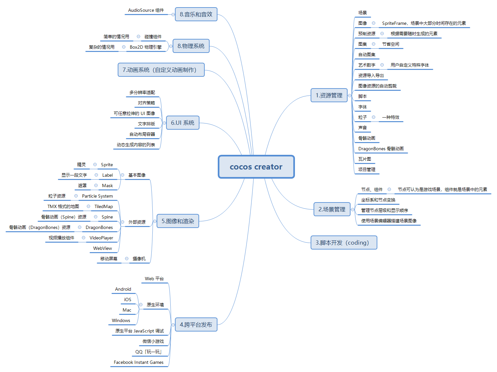
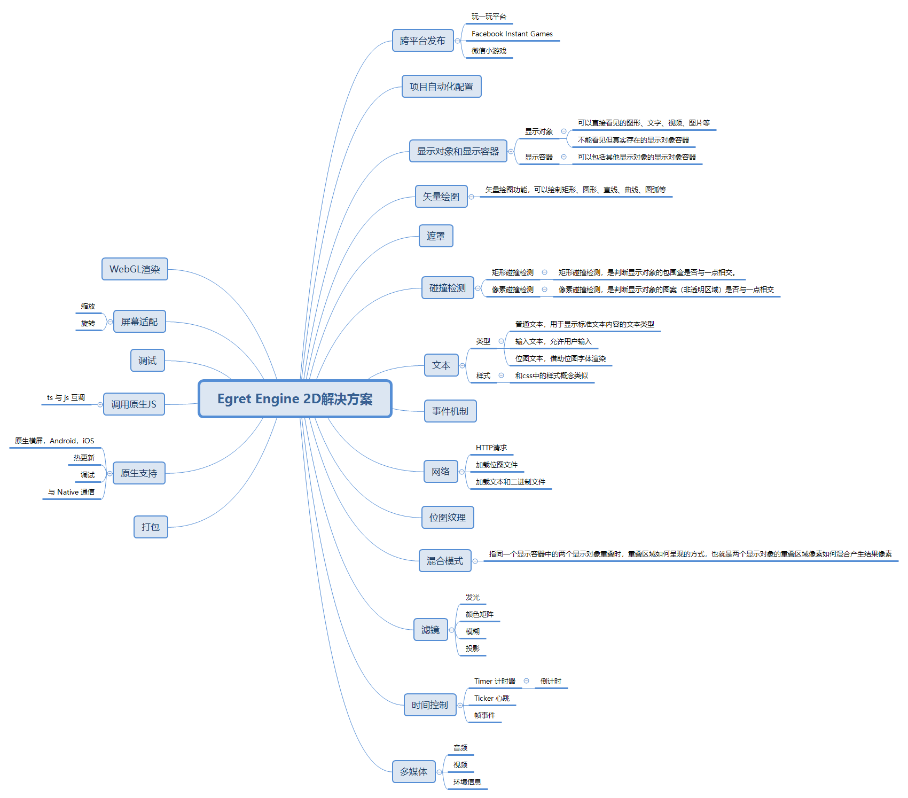
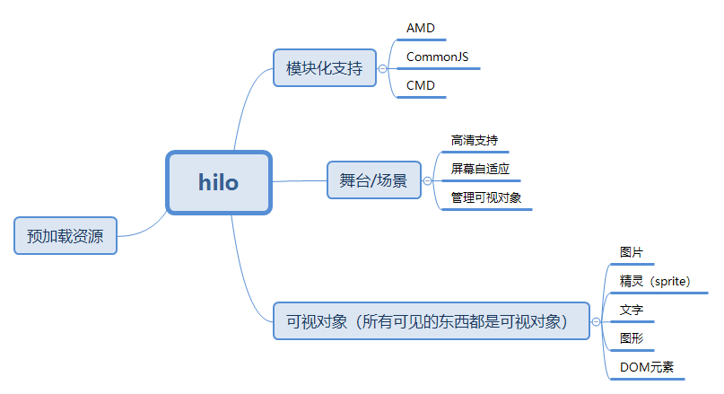

# 几款html 5 canvas游戏引擎的调研

## 背景

为满足对用户增长的需求，游戏类活动页开发逐渐提上日程，而我们对这方面积累不多。

## 问题分析

### 引入游戏引擎原因

原生canvas只提供了画布实现，在游戏开发角度上，对开发者而言，仍有许多工作要做：

- 场景构建（画面中不动的东西）
- 物体构建（画面中动的东西）
- 动画实现（让画面中的东西动起来）
- 物理算法（模拟现实效果）
- 游戏业务逻辑

其中，除游戏业务逻辑外，其余部分皆可重复使用。

所以，可以认为，引入游戏引擎有一定的必要性。

### 面向的业务场景与其带来的要求

我们的目的是用户增长，具体手段是营销活动页。

所以，游戏载体是营销活动页，则游戏的业务与体积都必须轻量、小型，便于用户接受、传播。

另外，微信小游戏在传播方面有其天然的巨大优势，在这方面也要有一定的考虑。

## 需求提取

对于游戏引擎的调研，需要从以下角度调研：

- 文档可读性
- 开发出来的产品的性能、体积
- 其带来的工具链或解决方案是否契合我们的业务场景 -- 轻量、小型的营销活动页、微信小游戏

## 目标引擎

### hilo

Hilo作为一个跨终端的互动小游戏解决方案，同时有称综合解决方案。从它的演变来看，Hilo属于阿里前端在实践总总结出来的一套工具库。

### Egret

Egret不仅仅提供了一个基于HTML5技术的游戏引擎，更是提供了原生打包工具和众多周边产品，使其成为“解决方案”

### Cocos

老牌又流行的解决方案

## cocos creator

## Egret Engine 2D

## hilo

## 比较

满分5星

比较维度：
- 文档
- 原型构建(开发速度)
- debug
- 与现有开发流程、构建流程、业务体系结合
- 后续运营维护(迭代、事件上报、日志上报)

### cocos creator
- 文档
    1. 较完善
    1. 有简单的实例教程
    1. cocos js的文档老旧，与当前版本不符
    1. 结论：3星
- 原型构建(开发速度)
    1. 很大一部分是UI操作
    1. 快
    1. 结论：5星
- debug
    1. 报错信息完整
    1. 但要看懂报错信息的话，必须对cocosjs有一定了解
    1. 结论：1星
- 与现有开发流程、构建流程、业务体系结合
    1. 当前团队模块化方案为commonjs, 构建工具为 gulp + webpack, 与后端结合点是后端模版直出+接口调用
    1. cocos creator构建封闭程度较高，与现有业务结合有一定的配置工作
    1. 结论：1星
- 后续运营维护(迭代、事件上报、日志上报)
    1. 当前的事件上报、日志上报皆有commonjs规范的组件，不能和creator无缝结合
    1. creator的开发为另一套流程体系，和现有体系需重新磨合，迭代有一定的磨合工作
    1. 结论：1星

### Egret Engine 2D
- 文档
    1. 较完善
    1. 没有简单的实例教程，上手相对麻烦
    1. 结论：2星
- 原型构建(开发速度)
    1. 和当前前端开发形式一致
    1. 结论：3星
- debug
    1. 报错信息完整
    1. 结论：3星
- 与现有开发流程、构建流程、业务体系结合
    1. 当前团队模块化方案为commonjs, 构建工具为 gulp + webpack, 与后端结合点是后端模版直出+接口调用
    1. Egret Engine 2D构建封闭程度较高，与现有业务结合有一定的配置工作
    1. 结论：1星
- 后续运营维护(迭代、事件上报、日志上报)
    1. 当前的事件上报、日志上报皆有commonjs规范的组件，不能和Egret Engine 2D无缝结合
    1. Egret Engine 2D的开发为另一套流程体系，和现有体系需重新磨合，迭代有一定的磨合工作
    1. Egret Engine 2D基于typescript，利于迭代维护
    1. 结论：2星

### hilo
- 文档
    1. 较完善
    1. 有简单的实例教程
    1. 结论：5星
- 原型构建(开发速度)
    1. 和当前前端开发形式一致
    1. 结论：3星
- debug
    1. 报错信息完整
    1. 结论：3星
- 与现有开发流程、构建流程、业务体系结合
    1. 当前团队模块化方案为commonjs, 构建工具为 gulp + webpack, 与后端结合点是后端模版直出+接口调用
    1. hilo可使用commonjs模块方案加载，可用gulp + webpack构建，与后端结合也十分方便
    1. hilo是针对运营活动类小游戏而产生的解决方案，和我们当前背景一致
    1. 结论：5星
- 后续运营维护(迭代、事件上报、日志上报)
    1. 当前的事件上报、日志上报皆有commonjs规范的组件，可以和hilo无缝结合
    1. hilo可无缝融入当前开发体系
    1. 结论：5星
