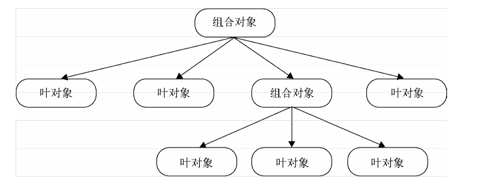

# 活动页可配置化的一点探索 -- 组合模式的构建与使用

## 背景

就2018年而言，小组的工作重点，在于承接公司因「用户增长」战略而产生的大量需求。

经过这半年的满负荷和之前几年的半负荷「活动页」项目运载，不论是产品侧还是开发侧，都可以明显察觉到 -- 大部分的活动推广页，其实都有着相似的流程、逻辑，当中有很多明显可复用的模块在等待被抽象提取。

对于这些可复用的模块，目前可抽取出这么一些：

1. 分享模块
    1. 分享活动页本身
    1. 分享出特殊分享页（被分享人和分享人可通过此分享页建立关系）
1. 上报模块
    1. 产品侧使用
        1. 用户事件上报：主要是点击事件上报，上报至BI组负责维护的罗盘系统
        1. 页面pvuv上报：同样上报至罗盘系统
        1. 香港地区活动的google sem上报
    1. 开发侧使用
        1. 错误事件上报：上报至monitor系统进行打点累计、监控，超过告警值则发出警告短信
        1. 普通事件上报：同样上报至monitor系统进行打点累计、监控，开发人员对页面各种事件触发量有个整体了解
        1. 错误日志上报：错误事件发生时，会有错误日志同时上报至uls系统，开发人员可进行事件回溯
        1. 普通日志上报：同样是用于帮助开发人员进行事件回溯
1. 送奖励型业务模块，包括
    1. 注册送奖励、开户送奖励（大部分的开户送奖励都隐藏在「注册送奖励」后，但用户注册后会被告知「实际奖励得开户后才能领到」）
    1. 入金送奖励
    1. 邀请他人注册、开户送奖励（邀请人得到奖励，被邀请人也得到奖励；这里的核心在于邀请人和被邀请人间会建立起一个关系）
    1. 新特性推广期，使用人获得奖励

## 需求分析

根据上面罗列的模块，模块间有一定的层级关系，但同一层级下的不同模块基本互不干涉。而活动推广页的构建，也基本是上述模块的堆砌。

所以，如果要完成「活动页可配置化」这个需求，基本要做到下面几点：

1. 可复用模块抽象提取
1. 同一层级模块互不依赖，可独立运行
1. 模块可被统一组织、驱动

按照上述分析，可使用组合模式来满足上述需求

## 组合模式介绍

一句话描述：组合模式就是构建一个树，然后对里面的节点进行深度优先的遍历。



## 组合模式使用

下面是一个简单地例子：

```html
<html> 
<body>
<button id="button">按我</button>
</body>
<script>

var MacroCommand = function () {
    return {
        commandsList: [],
        add: function (command) {
            this.commandsList.push(command);
        },
        execute: function () {
            for (var i = 0, command; command = this.commandsList[i++];) {
                command.execute();
            }
        }
    }
};
var openAcCommand = {
    execute: function () {
        console.log('打开空调');
    }
};

/**********家里的电视和音响是连接在一起的，所以可以用一个宏命令来组合打开电视和打开音响的命令 *********/

var openTvCommand = {
    execute: function () {
        console.log('打开电视');
    }
};
var openSoundCommand = {
    execute: function () {
        console.log('打开音响');
    }
};
var macroCommand1 = MacroCommand();
macroCommand1.add(openTvCommand);
macroCommand1.add(openSoundCommand);

/*********关门、打开电脑和打登录 QQ 的命令****************/

var closeDoorCommand = {
    execute: function () {
        console.log('关门');
    }
};

var openPcCommand = {
    execute: function () {
        console.log('开电脑');
    }
}

var openQQCommand = {
    execute: function () {
        console.log('登录 QQ');
    }
};
var macroCommand2 = MacroCommand(); 
macroCommand2.add(closeDoorCommand); 
macroCommand2.add(openPcCommand); 
macroCommand2.add(openQQCommand);

/*********现在把所有的命令组合成一个“超级命令”**********/

var macroCommand = MacroCommand(); 
macroCommand.add(openAcCommand); 
macroCommand.add(macroCommand1); 
macroCommand.add(macroCommand2);

/*********最后给遥控器绑定“超级命令”**********/

var setCommand = (function (command) {
    document.getElementById('button').onclick = function () {
        command.execute();
    }
})(macroCommand);

</script>
</html>
```

## 组合模式与活动页业务的结合

组合模式解决的问题，主要是模块的统一组织、驱动问题。这里面的前提条件有两个：

1. 模块必须暴露出统一的接口
1. 模块间必须互不影响、互不依赖

初步来看，上面提取出的上报模块、大部分奖励业务模块可以很好地和组合模式结合，而分享模块和奖励模块中的邀请小模块有一定的联系，目前还不好处理。

## 注意

因为不了解后端业务情况，上述模块抽象提取在和后端业务结合后，肯定还有比较大的调整。

目前先思考这么多，完。