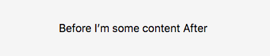
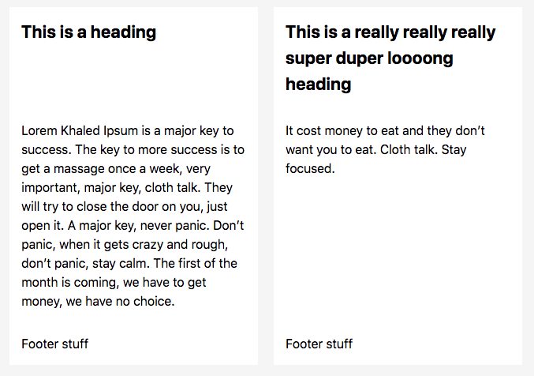
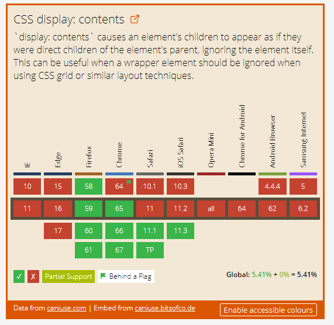

# 【翻译转载】display:content; 工作方式

> 原文出处：[How display: contents; Works](https://bitsofco.de/how-display-contents-works/)

正如我经常提到的那样，[文档树中的每个元素都是一个矩形盒子](https://bitsofco.de/controlling-the-box-model/)。 一般来说，这个“矩形框”由两部分组成。 首先我们有实际的盒子，它由边框，填充和边缘区域组成。 其次，我们有箱子的内容-具体内容区域。


通过CSS的display属性，我们可以控制元素及其子项在页面绘制时的表现形式。 通过display:inline，我们可以将这个盒子放在其兄弟姐妹中，就像文本一样。 通过display:table，我们可以欺骗盒子，使其表现的像table元素一样。 我们甚至可以将盒子放置在完全不同的Z轴上。

对于display属性，有两个值可以控制元素是否构成盒子。 none值将导致盒子与其内容不在页面上绘制。 另一方面，新指定的content值会令盒子周围的框会被完全省略，其内容被正常绘制。

## 当你使用display:content;时会发生什么

理解display：contents最简单方法，就是想象元素的开始标记和结束标记被删除，只剩下内容。 在[规范](https://www.w3.org/TR/css-display-3/#box-generation)中，它规定 -

>For the purposes of box generation and layout, the element must be treated as if it had been replaced in the element tree by its contents

例如下面的标记 -

```html
<div class="outer">
  I’m some content
  <div class="inner">I’m some inner content</div>
</div>
```

和下面的样式 -
```css
.outer {
  border: 2px solid lightcoral;
  background-color: lightpink;
  padding: 20px;
}

.inner {
  background-color: #ffdb3a;
  padding: 20px;
}
```

通常情况下，我们期望在页面上绘制元素的方式会是这样 -


但是，如果我们将display：contents添加到.outer元素样式中，那么它将这样显示 -


从视觉上而言，上述结果与我们所期望的结果完全相同--元素的开始标签和结束标签被删除的话，的确会是这个样子。

## 其他方面的表现

这个CSS规则虽然看似简单，但有很多边界案例和特定行为需要注意。 我们必须记住，display：contents规则仅影响在页面上可视化绘制的框; 它不会影响文档中的标记。

### 对元素属性的影响

如果元素被其内容替换，那么对于应用于它的属性意味着什么？ 由于这个替换大部分只是可视化的，所以我们实际上仍然可以使用它的属性来选择，定位和与元素进行交互。

我们仍然可以通过它的ID来标识元素，例如，使用aria-labelledby对其进行引用。

```html
<div id="label" style="display: contents;">Label here!</div>
<button aria-labelledby="label"><button>
```

但是，我发现我们无法再使用元素id导航到元素。

```html
<div id="target" style="display: contents;">Target Content</div>

<script>
  window.location.hash = "target";
  // => Nothing happens
</script>
```

### 对javascript事件的影响

正如我们刚刚介绍的，我们仍然可以定位使用 display: contents; 的元素。实际上，我们也可以定位使用 display: none; 的元素，但事件永远不会触发，因为我们无法和元素进行交互。但是，由于使用 display: contents; 的元素仍然可见，我们可以通过元素内容与其进行交互。

例如，我们对一个元素设置点击事件，并打印this值。我们仍然可以获取.outer元素，因为它仍然存在于文档中。

```html
<div class="outer">I’m some content</div>

<script>
  document.querySelector(".outer").addEventListener("click", function(event) {
    console.log(this);
    // => <div class="outer"></div>
  });
</script>
```

### 对伪元素的影响

使用 display：content; 的元素的伪元素被认为是其子元素的一部分，因此显示为正常。

```html
<style>
  .outer { display: contents; }
  .outer::before { content: "Before" }
  .outer::after { content: "After" }
</style>

<div class="outer">I’m some content</div>
```

上面的style标签会产生下面的样式 -



### 对from元素、img元素以及其他替换元素的影响

>[替换元素（replaced element）与非替换元素(non-replaced element)](https://blog.csdn.net/ruoyiqing/article/details/39011487)

当替换元素与from元素使用 display: contents; 时，他们会有不同的表现。

#### 替换元素

替换元素，比如img元素，其外观与盒模型由外部资源控制。试图删除这样的元素框并没有什么意义，因为程序不清楚此元素的盒模型是什么。对于这些元素，display: contents 的功能与display: none完全相同。元素的整个框和内容都没有绘制在页面上。

#### 表单元素

对于表单元素而言，它们不是由一个“盒子”组成的。 从网页作者的角度来看，他们看起来就该那样。 但在背后，它们由几个较小的元件组成。与被替换的元素类似，删除这些元素的框没有意义，因为他们没有构成盒模型。 因此，对于select，input和textarea等表单元素，display：contents的功能与display：none完全相同。

> [full list of elements that display: contents works differenly fo](https://www.w3.org/TR/css-display-3/#unbox-html)

### 对于按钮(button)和链接(link)的影响

当涉及到display：contents时，button和a元素都没有任何特殊的行为。 然而，了解这条规则如何影响它们是有用的，因为它可能不是很明显。

#### 按钮

按钮不是由其他框组成的表单元素之一。因此，display: contents; 将只删除周围的框，而让按钮的内容正常显示。如果在表单中使用，单击按钮仍然会尝试提交表单，正如我们已经介绍的那样，按钮上的任何事件侦听器都将正常运行。

#### 链接

对于链接，也是相同的情况。视觉上删除周围的框，链接的内容仍然保留。 由于attribute通常不受此CSS规则的影响，因此该链接仍然可以正常运行，并可用于正常导航。

## display: contents; 有何用处？

在过去，我们不得不以一种既语义化，又可让CSS进行样式设计的方式来布局HTML。这导致我们要么包装了太多的元素，要么元素太少以至于需要启用兄弟选择器。那些需要使用兄弟选择器的情况，是引入CSS Grid Layout的重要原因。（这段好像翻译的有点问题）

举个例子，我们来看这个布局 -



我们有两张彼此相邻的“卡片”，每张都有一个标题，一个段落和一个页脚。我们想要的是每张卡内的每个部分都是相同的高度，而不管每个部分的内容如何（例如，第一张卡片只有1行，而第三张卡片有3行标题，但是第一张卡片的标题部分高度应该与第三个相匹配）。

我们可以使用CSS Grid来实现这种布局，但是我们需要每个“卡片”中的所有元素成为彼此的兄弟元素。 所以，我们可能需要像这样布局我们的HTML -

```html
<div class="grid">
  <h2>This is a heading</h2>
  <p>...</p>
  <p>Footer stuff</p>
    
  <h2>This is a really really really super duper loooong heading</h2>
  <p>...</p>
  <p>Footer stuff</p>
</div>
```

我们可以应用以下样式 -

```css
.grid {
  display: grid;
  grid-auto-flow: column;
  grid-template-rows: auto 1fr auto;
  grid-template-columns: repeat(2, 1fr);
  grid-column-gap: 20px;
}
```

虽然这不是一个错误的构建文档方式，但通过article元素将每个元素分组可能更有意义。这时候就需要 display:contents; 出场了。我们有了两全的方案 - 通过有意义的语义化方式去组织元素，同时CSS也以合理的方式去完成布局。

```html
<div class="grid">
  <article style="display: contents;">
    <h2>This is a heading</h2>
    <p>...</p>
    <p>Footer stuff</p>
  </article>
  <article style="display: contents;">
    <h2>This is a really really really super duper loooong heading</h2>
    <p>...</p>
    <p>Footer stuff</p>
  </article>
</div>
```

使用与上面相同的CSS，我们可以实现我们想要的布局。

## 浏览器兼容状况

在撰写本文时，display:contents; 仅在两个主流浏览器中得到支持，其他支持很快就会到来。



>2018年03月27日浏览器兼容状况

因此，此功能目前仍应被视为渐进式增强功能，并应有适当的降级处理。

```html
article {
  display: grid;
  grid-template-rows: 200px 1fr auto; /* e.g. Use a fixed height for the header */
}

@supports (display: contents) {
  article { display: contents; }
}
```