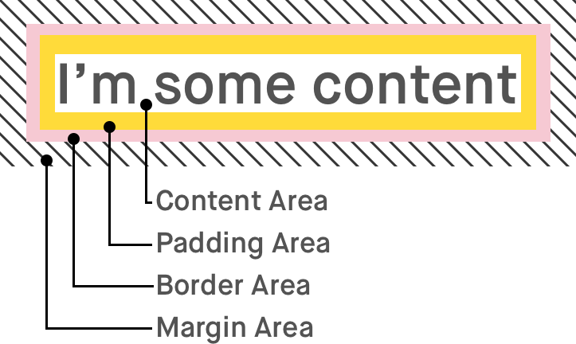
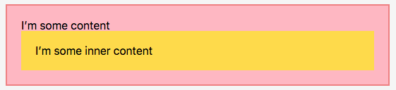
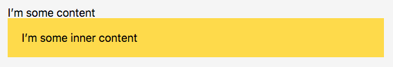

# 【翻译转载】display:content; 工作方式

> 原文出处：[How display: contents; Works](https://bitsofco.de/how-display-contents-works/)

正如我经常提到的那样，[文档树中的每个元素都是一个矩形盒子](https://bitsofco.de/controlling-the-box-model/)。 一般来说，这个“矩形框”由两部分组成。 首先我们有实际的盒子，它由边框，填充和边缘区域组成。 其次，我们有箱子的内容-具体内容区域。



通过CSS的display属性，我们可以控制元素及其子项在页面绘制时的表现形式。 通过display:inline，我们可以将这个盒子放在其兄弟姐妹中，就像文本一样。 通过display:table，我们可以欺骗盒子，使其表现的像table元素一样。 我们甚至可以将盒子放置在完全不同的Z轴上。

对于display属性，有两个值可以控制元素是否构成盒子。 none值将导致盒子与其内容不在页面上绘制。 另一方面，新指定的content值会令盒子周围的框会被完全省略，其内容被正常绘制。

## 当你使用display:content;时会发生什么

理解display：contents最简单方法，就是想象元素的开始标记和结束标记被删除，只剩下内容。 在[规范](https://www.w3.org/TR/css-display-3/#box-generation)中，它规定 -

>For the purposes of box generation and layout, the element must be treated as if it had been replaced in the element tree by its contents

例如下面的标记 -

```html
<div class="outer">
  I’m some content
  <div class="inner">I’m some inner content</div>
</div>
```

和下面的样式 -
```css
.outer {
  border: 2px solid lightcoral;
  background-color: lightpink;
  padding: 20px;
}

.inner {
  background-color: #ffdb3a;
  padding: 20px;
}
```

通常情况下，我们期望在页面上绘制元素的方式会是这样 -



但是，如果我们将display：contents添加到.outer元素样式中，那么它将这样显示 -



从视觉上而言，上述结果与我们所期望的结果完全相同--元素的开始标签和结束标签被删除的话，的确会是这个样子。

## 其他方面的表现

这个CSS规则虽然看似简单，但有很多边界案例和特定行为需要注意。 我们必须记住，display：contents规则仅影响在页面上可视化绘制的框; 它不会影响文档中的标记。

### 对元素属性的影响

如果元素被其内容替换，那么对于应用于它的属性意味着什么？ 由于这个替换大部分只是可视化的，所以我们实际上仍然可以使用它的属性来选择，定位和与元素进行交互。

我们仍然可以通过它的ID来标识元素，例如，使用aria-labelledby对其进行引用。

```html
<div id="label" style="display: contents;">Label here!</div>
<button aria-labelledby="label"><button>
```

但是，我发现我们无法再使用元素id导航到元素。

```html
<div id="target" style="display: contents;">Target Content</div>

<script>
  window.location.hash = "target";
  // => Nothing happens
</script>
```

### 对javascript事件的影响

正如我们刚刚介绍的，我们仍然可以定位使用 display: contents; 的元素。实际上，我们也可以定位使用 display: none; 的元素，但事件永远不会触发，因为我们无法和元素进行交互。但是，由于使用 display: content; 的元素仍然可见，我们可以通过元素内容与其进行交互。

例如，我们对一个元素设置点击事件，并打印this值，我们仍然可以获取.outer元素，因为它仍然存在于文档中。

```html
<div class="outer">I’m some content</div>

<script>
  document.querySelector(".outer").addEventListener("click", function(event) {
    console.log(this);
    // => <div class="outer"></div>
  });
</script>
```