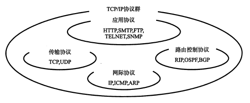
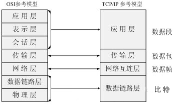
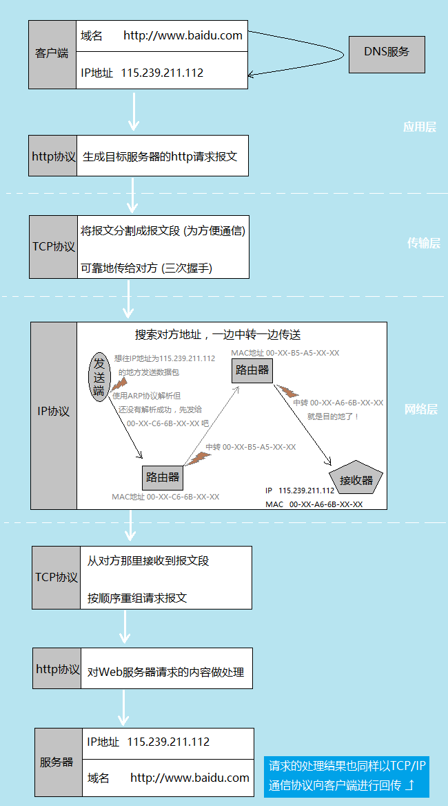

# TCP/IP协议群和http协议

## 关系图:

http协议在TCP/IP协议群中的位置:

TCP/IP协议群的分层：

其中，与HTTP关系密切的协议:

|名称|分层结构|主要作用|作用描述|
|---|---|---|---|
|DNS服务|应用层|负责域名解析|根据域名查询IP地址，或根据IP地址反查域名|
|TCP协议|传输层|确保可靠性|提供可靠的字节流服务|
|IP协议|网络层|负责传输|把各种数据包传送给对方|

## 几个协议的概述

### DNS服务

用户通常使用主机名或域名来访问对方的计算机，而不是直接通过 IP地址访问。因为与 IP 地址的一组纯数字相比，用字母配合数字的表示形式来指定计算机名更符合人类的记忆习惯。但要让计算机去理解名称，相对而言就变得困难了。因为计算机更擅长处理一长串数字。 

为了解决上述的问题，DNS 服务应运而生。DNS 协议提供通过域名查找 IP 地址，或逆向从 IP 地址反查域名的服务。

### TCP协议

TCP 协议为了更容易传送大数据，将大块数据分割成以报文段（segment）为单位的数据包进行管理。采用三次握手(three-way handshaking)策略，把数据包送出去后并确认是否成功送达(确保可靠性)。

握手过程中使用了 TCP 的标志（flag） — SYN（synchronize） 和ACK（acknowledgement）。发送端首先发送一个带 SYN 标志的数据包给对方。接收端收到后，回传一个带有 SYN/ACK 标志的数据包以示传达确认信息。最后，发送端再回传一个带 ACK 标志的数据包，代表“握手”结束。若在握手过程中某个阶段莫名中断，TCP 协议会再次以相同的顺序发送相同的数据包。 

### IP协议

IP 协议的作用是把各种数据包传送给对方。而要保证确实传送到对方那里，则需要满足各类条件。其中两个重要的条件是 IP 地址和 MAC地址（Media Access Control Address）。

|名称|描述|
|---|---|
|IP 地址|指明了节点被分配到的地址，容易发生改变|
|MAC 地址|是指网卡所属的固定地址，一般不会发生改变|

IP 间的通讯依赖 MAC地址，而 IP地址可以和 MAC地址进行配对，并且通过ARP协议（Address Resolution Protocol）来解析地址，从而通过通信方的 IP地址反查出对应的 MAC地址。当主机A要与主机B通信时，ARP协议（地址解析协议）可以将主机B的IP地址（192.168.1.2）解析成主机B的MAC地址，MAC地址一旦确定，主机A就能向主机B发送IP通信了。

## 这些协议在一次http请求中的作用

## web页面性能优化与这几个协议的关系

web页面性能优化，主要是以下几个方向：

1. 尽量合并请求，减少页面总请求数：在http 1.1 协议下，每次完成一个http请求，实际都是建立了一个tcp请求，然后又断开；每次建立tcp请求，都需要花点时间在‘3次握手’上；尽量合并请求，可以剩下建立tcp请求时的多余耗时。
1. 增加浏览器的同时请求数：资源处于不同域名下，可以增加浏览器的http同时请求数；这个主要是对浏览器的策略做出应对。
1. 资源压缩：体积越小的资源，下载的时间越短。
1. 缓存：除了对http请求响应的缓存，浏览器还有可能对dns的解析结果做缓存

