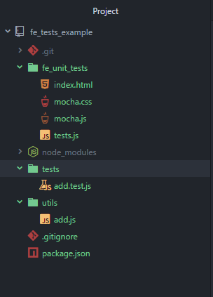
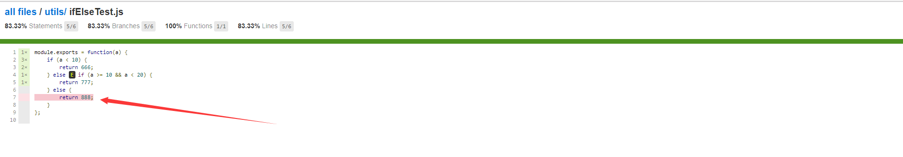

# 前端组件测试构建指引

##  背景
1. 前端组件被业务依赖，需要保证其可靠性
2. 前端组件需要迭代，则完整、可靠的测试用例可保证迭代安全
3. 良好的测试可以让开发人员在开发时不再关注测试，提高工作效率

##  对业务代码的要求
要构建良好的测试，对被测代码也有一定的要求。
1. 保持代码短小精悍，命令型代码块（do something）和查询型代码块（get something）需要分割至不同的函数
2. 使用代码校验工具，比如eslint
3. 圈复杂度，又称代码分支，也就是代码中if else的数量，尽量少于5，有助于提升测试覆盖率
4. 不出现重复代码
5. 代码需要注释

## 测试工具选型

### 测试框架选型：
1. Qunit
2. jasmine
3. mocha

前端组件的使用场景中，有大量的异步操作。上述3个测试框架，只有mocha可以很方便地进行异步测试。所以，测试框架使用mocha。

### 断言库选型：
1. better-assert，C-style TDD 断言库
2. should.js，BDD 风格断言库
3. expect.js， 追求极简的 BDD 风格断言库，基于 should.js 简化
4. chai， BDD/TDD 双模 ，同时支持 should / expect / assert 三种风格的断言库强大插件机制

google mocha的使用教程，断言库都是chai，所以。。。。。。

### 代码覆盖率工具
1. istanbul
2. 。。。

javascript的代码覆盖率工具中，istanbul流行度最高。

### UI测试模式选型：
1. casperjs+phantomjs，phantomjs是无界面浏览器，casperjs对phantomjs api进行了提高易用性的封装
2. Selenium 1，会起一个服务，开发人员给这个服务发布任务，服务会通过给浏览器注入javascript的方式驱动浏览器
3. webdriver，直接调用浏览器自动化的本地接口，驱动浏览器；可以直接在浏览器中运行。
4. Selenium 2，集成了webdriver。UI测试时会启动一个服务，开发人员给这个服务发布任务，服务会通过webdriver驱动浏览器
5. chrome的headless模式，就是chrome的无界面模式，可以通过其自身暴露的api进行驱动，也可以通过webdriver驱动。

chrome的headless模式发布后，phantomjs的作者已经宣布不再维护phantomjs。第一个方案否决。
chrome的headless模式目前才发布两个月，还没有多少实践案例，鉴于其可通过webdriver驱动，暂时观察之。
webdriver已被w3c标准化，各大浏览器都已实现其标准。这种驱动浏览器的方式，使用十分广泛，实践案例很多。
Selenium 和 webdriver 目前是合并趋势。
综上，使用第四方案。对应至node.js平台，使用selenium-webdriver模块和selenium服务进行通信。 

### 和selenium服务通信的工具选型
1. selenium-webdriver，社区活跃，在npm上看到下载量最高
2. webdriverIO，api比selenium-webdriver友好，但配套测试工具配置起来比selenium-webdriver的要麻烦，npm下载量是selenium-webdriver的0.1倍
3. WD.js，没用过，npm下载量同样是selenium-webdriver的0.1倍。
selenium-webdriver的下载量最高，则在搜索具体问题的解决方案时，出来的信息应该也是最多的。此处选择selenium-webdriver。


## 测试的基本概念
我们可以构建一个简单的项目，在这个过程中了解测试的基本概念
```
mkdir fe_tests_example
cd fe_tests_example
npm init
npm install -g mocha
npm install mocha chai --save
```
建立文件 ./utils/add.js
```
module.exports = function(a, b) {
    return a + b;
};
```
建立文件 ./tests/add.test.js
```
var expect = require('chai').expect;

var add = require('../utils/add');

describe('add 方法测试', function() {
    it('2+2=4', function() {
        expect(add(2, 2)).to.be.equal(4);
    });
    it('5+6=11', function() {
        expect(add(5, 6)).to.be.equal(11);
    });
    it('0+(-2)=-2', function() {
        expect(add(0, -2)).to.be.equal(-2);
    });
});
```
运行指令
```
mocha tests\*.js
```
可以看到
```
D:\work\fe_tests_example (master) (fe_tests_example@1.0.0)
λ mocha tests\*.js


  add 方法测试
    √ 2+2=4
    √ 5+6=11
    √ 0+(-2)=-2


  3 passing (21ms)
```
这就是一次单元测试。

其中，add.test.js是测试脚本，一个个it代码块就是一个个测试用例。

接下来是在浏览器环境下进行单元测试：
首先
```
mocha init fe_unit_tests
```
可以看到项目下多了个 fe_unit_tests文件夹


建立fe_unit_tests/add.js文件
```
function add(a, b) {
    return a + b;
};
```

修改 fe_unit_tests/tests.js文件：
```
var expect = chai.expect;

describe('add 方法测试', function() {
    it('2+2=4', function() {
        expect(add(2, 2)).to.be.equal(4);
    });
    it('5+6=11', function() {
        expect(add(5, 6)).to.be.equal(11);
    });
    it('0+(-2)=-2', function() {
        expect(add(0, -2)).to.be.equal(-2);
    });
});
```
修改 fe_unit_tests/index.html文件
```
<!DOCTYPE html>
<html>
  <head>
    <title>Mocha</title>
    <meta http-equiv="Content-Type" content="text/html; charset=UTF-8">
    <meta name="viewport" content="width=device-width, initial-scale=1.0">
    <link rel="stylesheet" href="mocha.css" />
  </head>
  <body>
    <div id="mocha"></div>
    <script src="mocha.js"></script>
    <script src="http://chaijs.com/chai.js"></script>
    <script>mocha.setup('bdd');</script>
    <script src="add.js"></script>
    <script src="tests.js"></script>
    <script>
      mocha.run();
    </script>
  </body>
</html>
```

这就是浏览器环境下的单元测试

## UI测试
我们将继续通过实例项目来了解UI测试

下载最新的[JDK](http://www.oracle.com/technetwork/java/javase/downloads/index.html)，安装之。
下载最新的[selenium](http://selenium-release.storage.googleapis.com/index.html)，一个jar包，不用安装。
运行 selenium服务
```
java -jar selenium-server-standalone-2.45.0.jar
```
可以看到
```
λ java -jar selenium-server-standalone-3.4.0.jar
15:15:07.198 INFO - Selenium build info: version: '3.4.0', revision: 'unknown'
15:15:07.200 INFO - Launching a standalone Selenium Server
2017-06-06 15:15:07.250:INFO::main: Logging initialized @549ms to org.seleniumhq.jetty9.util.log.StdErrLog
15:15:07.345 INFO - Driver class not found: com.opera.core.systems.OperaDriver
15:15:07.349 INFO - Driver provider com.opera.core.systems.OperaDriver registration is skipped:
Unable to create new instances on this machine.
15:15:07.350 INFO - Driver class not found: com.opera.core.systems.OperaDriver
15:15:07.351 INFO - Driver provider com.opera.core.systems.OperaDriver is not registered
15:15:07.352 INFO - Driver provider org.openqa.selenium.safari.SafariDriver registration is skipped:
 registration capabilities Capabilities [{browserName=safari, version=, platform=MAC}] does not match the current platform VISTA
2017-06-06 15:15:07.453:INFO:osjs.Server:main: jetty-9.4.3.v20170317
2017-06-06 15:15:07.521:INFO:osjsh.ContextHandler:main: Started o.s.j.s.ServletContextHandler@28d25987{/,null,AVAILABLE}
2017-06-06 15:15:07.900:INFO:osjs.AbstractConnector:main: Started ServerConnector@3f49dace{HTTP/1.1,[http/1.1]}{0.0.0.0:4444}
2017-06-06 15:15:07.901:INFO:osjs.Server:main: Started @1200ms
15:15:07.901 INFO - Selenium Server is up and running
```

下载对应的浏览器驱动

| browser |  component|  
| :-------- | --------:| 
| Chrome | [chromedriver(.exe)](http://chromedriver.storage.googleapis.com/index.html) | 
| Internet Explorer | [IEDriverServer.exe](http://selenium-release.storage.googleapis.com/index.html) | 
| Edge | [MicrosoftWebDriver.msi](http://go.microsoft.com/fwlink/?LinkId=619687) | 
| Firefox 47+ | [geckodriver(.exe)](https://github.com/mozilla/geckodriver/releases/) | 
| PhantomJS | [phantomjs(.exe)](http://phantomjs.org/) | 
| Opera | [operadriver(.exe)](https://github.com/operasoftware/operachromiumdriver/releases) | 
| Safari | [safaridriver](https://developer.apple.com/library/prerelease/content/releasenotes/General/WhatsNewInSafari/Articles/Safari_10_0.html#//apple_ref/doc/uid/TP40014305-CH11-DontLinkElementID_28) |  

在这里，我下载了chrome、firefox、ie的驱动，和刚才下好的selenium jar包放入同一个文件夹。

这里有需要注意的几个点：
1. chrome的驱动，最新的是2.2X那些，2.4是很老的版本。
2. IE的webdriver驱动IE失败的话，尝试下修改注册表：注册表（regedit）中，32位系统寻找 HKEY_LOCAL_MACHINE\SOFTWARE\Microsoft\Internet Explorer\Main\FeatureControl\FEATURE_BFCACHE ，64位系统寻找HKEY_LOCAL_MACHINE\SOFTWARE\Wow6432Node\Microsoft\Internet
Explorer\Main\FeatureControl\FEATURE_BFCACHE ，FEATURE_BFCACHE项不一定存在，不存在就创建之。然后在这个项里面，创建一个DWORD值，name为 iexplore.exe， value为0。

ps:上面是自行安装配置使用selenium服务的方法。还可以通过工具包对selenium进行安装配置使用，具体请看[ui-h5-dialog组件test分支的test_guide.md](http://gitlab.futunn.com/webpackage/ui-h5-dialog/blob/test/test_guide.md)

接下来，回到 fe_tests_example项目中
```
npm install selenium-webdriver --save
```

建立 ui_tests/test1.js文件
```
var webdriver = require('selenium-webdriver'),
    By = webdriver.By,
    until = webdriver.until,
    test = require('selenium-webdriver/testing');

test.describe('百度搜索测试1,firefox浏览器', function() {
    this.timeout(15000);
    var driver;

    test.before(function() {
        driver = new webdriver.Builder().forBrowser('firefox').usingServer('http://localhost:4444/wd/hub').build();
    });

    test.it('搜索node.js', function() {
        driver.get('http://www.baidu.com');
        driver.findElement(By.name('wd')).sendKeys('node.js');
        driver.findElement(By.id('su')).click();
        driver.wait(until.titleIs('node.js_百度搜索'), 10000);
    });

    test.it('搜索jquery', function() {
        driver.get('http://www.baidu.com');
        driver.findElement(By.name('wd')).sendKeys('jquery');
        driver.findElement(By.id('su')).click();
        driver.wait(until.titleIs('jquery_百度搜索'), 10000);
    });

    test.it('搜索angular', function() {
        driver.get('http://www.baidu.com');
        driver.findElement(By.name('wd')).sendKeys('angular');
        driver.findElement(By.id('su')).click();
        driver.wait(until.titleIs('angular_百度搜索'), 10000);
    });

    test.after(function() {
        driver.quit();
    });
});
```

建立 ui_tests/test2.js文件
```
var webdriver = require('selenium-webdriver'),
    By = webdriver.By,
    until = webdriver.until,
    test = require('selenium-webdriver/testing');

test.describe('百度搜索测试2,chrome浏览器', function() {
    this.timeout(15000);
    var driver;

    test.before(function() {
        driver = new webdriver.Builder().forBrowser('chrome').usingServer('http://localhost:4444/wd/hub').build();
    });

    test.it('搜索sublime', function() {
        driver.get('http://www.baidu.com');
        driver.findElement(By.name('wd')).sendKeys('sublime');
        driver.findElement(By.id('su')).click();
        driver.wait(until.titleIs('sublime_百度搜索'), 10000);
    });

    test.it('搜索webstorm', function() {
        driver.get('http://www.baidu.com');
        driver.findElement(By.name('wd')).sendKeys('webstorm');
        driver.findElement(By.id('su')).click();
        driver.wait(until.titleIs('webstorm_百度搜索'), 10000);
    });

    test.it('搜索atom', function() {
        driver.get('http://www.baidu.com');
        driver.findElement(By.name('wd')).sendKeys('atom');
        driver.findElement(By.id('su')).click();
        driver.wait(until.titleIs('atom_百度搜索'), 10000);
    });

    test.after(function() {
        driver.quit();
    });
});
```

建立 ui_tests/test3.js文件
```
var webdriver = require('selenium-webdriver'),
    By = webdriver.By,
    until = webdriver.until,
    test = require('selenium-webdriver/testing');

test.describe('百度搜索测试3,ie测试', function() {
    this.timeout(15000);
    var driver;

    test.before(function() {
        driver = new webdriver.Builder().forBrowser('internet explorer').usingServer('http://localhost:4444/wd/hub').build();
    });

    test.it('搜索webdriver', function() {
        driver.get('http://www.baidu.com');
        driver.findElement(By.name('wd')).sendKeys('webdriver');
        driver.findElement(By.id('su')).click();
        driver.wait(until.titleIs('webdriver_百度搜索'), 10000);
    });

    test.it('搜索selenium', function() {
        driver.get('http://www.baidu.com');
        driver.findElement(By.name('wd')).sendKeys('selenium');
        driver.findElement(By.id('su')).click();
        driver.wait(until.titleIs('selenium_百度搜索'), 10000);
    });

    test.it('搜索mocha', function() {
        driver.get('http://www.baidu.com');
        driver.findElement(By.name('wd')).sendKeys('mocha');
        driver.findElement(By.id('su')).click();
        driver.wait(until.titleIs('mocha_百度搜索'), 10000);
    });

    test.after(function() {
        driver.quit();
    });
});
```

然后
```
$ mocha .\ui_tests\*.js
```

可以看到


以上就是一次完整的UI测试。

## 测试覆盖率

测试覆盖率是针对单元测试的指标，他有下面几个维度：

 1. 行覆盖率（line coverage）：是否每一行都执行了？
 2. 函数覆盖率（function coverage）：是否每个函数都调用了？
 3. 分支覆盖率（branch coverage）：是否每个if代码块都执行了？
 4. 语句覆盖率（statement coverage）：是否每个语句都执行了？

我们来实践一下。

```
npm install istanbul --save
```

建立utils/ifElseTest.js文件
```
module.exports = function(a) {
    if (a < 10) {
        return 666;
    } else if (a >= 10 && a < 20) {
        return 777;
    } else {
        return 888;
    }
};

```

建立test/ifElseTest.test.js文件
```
var expect = require('chai').expect;

var ifElseTest = require('../utils/ifElseTest');

describe('ifElseTest 方法测试', function() {
    it('expect(ifElseTest(5)).to.be.equal(666);', function() {
        expect(ifElseTest(5)).to.be.equal(666);
    });
    it('expect(ifElseTest(6)).to.be.equal(666);', function() {
        expect(ifElseTest(6)).to.be.equal(666);
    });
    it('expect(ifElseTest(17)).to.be.equal(777);', function() {
        expect(ifElseTest(17)).to.be.equal(777);
    });
});
```

改写 package.json中的scripts部分:
```
{
  "name": "fe_tests_example",
  "version": "1.0.0",
  "description": "",
  "main": "index.js",
  "scripts": {
    "test": "mocha ./test/*.js",
    "test-cov": "./node_modules/.bin/istanbul cover ./node_modules/mocha/bin/_mocha ./test/*.test.js"
  },
  "repository": {
    "type": "git",
    "url": "http://gitlab.futunn.com/evanyan/fe_tests_example.git"
  },
  "author": "",
  "license": "ISC",
  "dependencies": {
    "chai": "^4.0.2",
    "mocha": "^3.4.2",
    "selenium-webdriver": "^3.4.0",
    "istanbul": "^0.4.5"
  }
}
```

然后:
```
npm run test-cov
```
可以看到：

```
λ npm run test-cov

> fe_tests_example@1.0.0 test-cov D:\work\fe_tests_example
> istanbul cover ./node_modules/mocha/bin/_mocha ./test/*.test.js


  add 方法测试
    √ 2+2=4
    √ 5+6=11
    √ 0+(-2)=-2

  ifElseTest 方法测试
    √ expect(ifElseTest(5)).to.be.equal(666);
    √ expect(ifElseTest(6)).to.be.equal(666);
    √ expect(ifElseTest(17)).to.be.equal(777);


  6 passing (199ms)

=============================================================================
Writing coverage object [D:\work\fe_tests_example\coverage\coverage.json]
Writing coverage reports at [D:\work\fe_tests_example\coverage]
=============================================================================

=============================== Coverage summary ===============================
Statements   : 87.5% ( 7/8 )
Branches     : 83.33% ( 5/6 )
Functions    : 100% ( 2/2 )
Lines        : 87.5% ( 7/8 )
================================================================================
```

此时项目中生成了 coverage文件夹，打开coverage/lcov-report/index.html，可以看到：


可以看到，ifElseTest.js中，其中有一个if-else代码块没有被测到。
我们改写一下 ifElseTest.test.js文件：
```
var expect = require('chai').expect;

var ifElseTest = require('../utils/ifElseTest');

describe('ifElseTest 方法测试', function() {
    it('expect(ifElseTest(5)).to.be.equal(666);', function() {
        expect(ifElseTest(5)).to.be.equal(666);
    });
    it('expect(ifElseTest(6)).to.be.equal(666);', function() {
        expect(ifElseTest(6)).to.be.equal(666);
    });
    it('expect(ifElseTest(17)).to.be.equal(777);', function() {
        expect(ifElseTest(17)).to.be.equal(777);
    });
    it('expect(ifElseTest(88)).to.be.equal(888);', function() {
        expect(ifElseTest(88)).to.be.equal(888);
    });
});
```

然后
```
npm run test-cov
```
可以看到：
```
λ npm run test-cov

> fe_tests_example@1.0.0 test-cov D:\work\fe_tests_example
> istanbul cover ./node_modules/mocha/bin/_mocha ./test/*.test.js


  add 方法测试
    √ 2+2=4
    √ 5+6=11
    √ 0+(-2)=-2

  ifElseTest 方法测试
    √ expect(ifElseTest(5)).to.be.equal(666);
    √ expect(ifElseTest(6)).to.be.equal(666);
    √ expect(ifElseTest(17)).to.be.equal(777);
    √ expect(ifElseTest(88)).to.be.equal(888);


  7 passing (50ms)

=============================================================================
Writing coverage object [D:\work\fe_tests_example\coverage\coverage.json]
Writing coverage reports at [D:\work\fe_tests_example\coverage]
=============================================================================

=============================== Coverage summary ===============================
Statements   : 100% ( 8/8 )
Branches     : 100% ( 6/6 )
Functions    : 100% ( 2/2 )
Lines        : 100% ( 8/8 )
================================================================================
```


可以看到测试覆盖率达到100%，被测代码的每一行都被测到。
具体代码可在http://gitlab.futunn.com/evanyan/fe_tests_example 中看到。

## 具体实践的一些建议

1. 所有测试代码，都应该放在test文件夹中
2. 单元测试测逻辑部分，被测代码的测试覆盖率尽量达到100%；端对端测试测试主要流程是否能跑通，针对前端ui组件，还有查看组件在不同浏览器下表现的任务。所以，单元测试的测试量应该比端对端测试大很多。
3. 单元测试只测逻辑部分代码，io操作、dom操作的代码不纳入单元测试范畴中。
4. io操作、dom操作的测试由端对端测试来完成。

## 参考

[mocha api 文档](http://mochajs.org/)
[chai api文档](http://chaijs.com/api/bdd/ "chai api doc")
[selenium-webdriver api文档](http://seleniumhq.github.io/selenium/docs/api/javascript/module/selenium-webdriver/)
